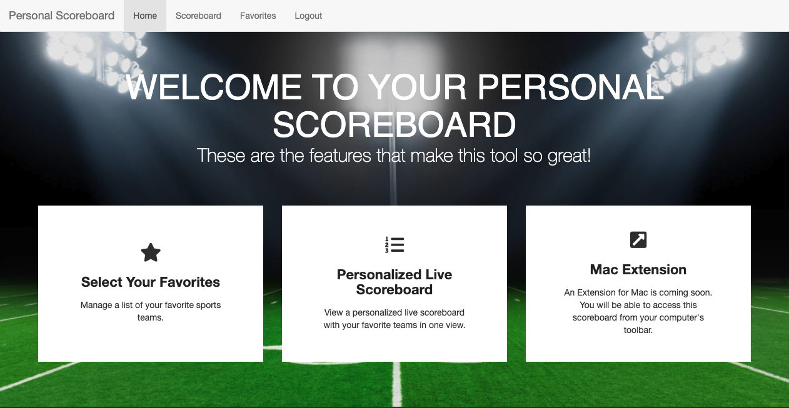
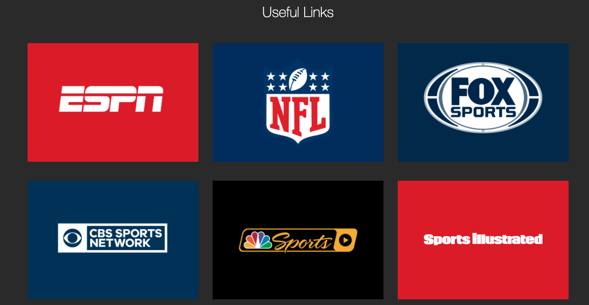
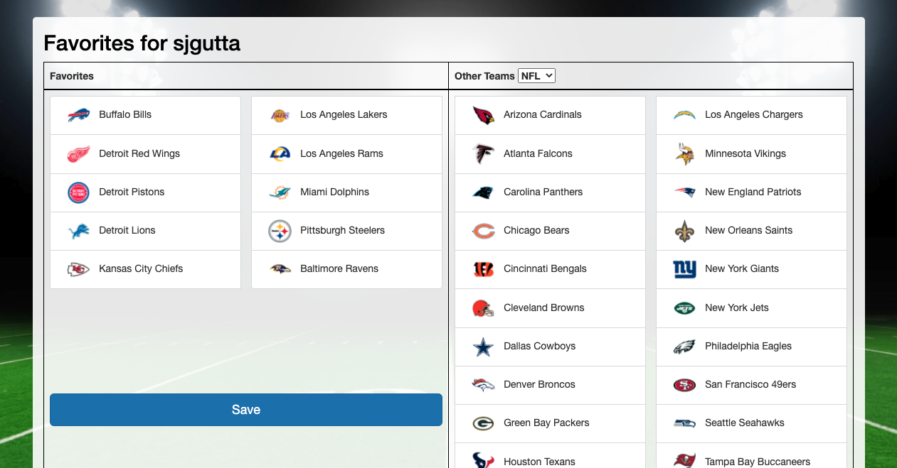
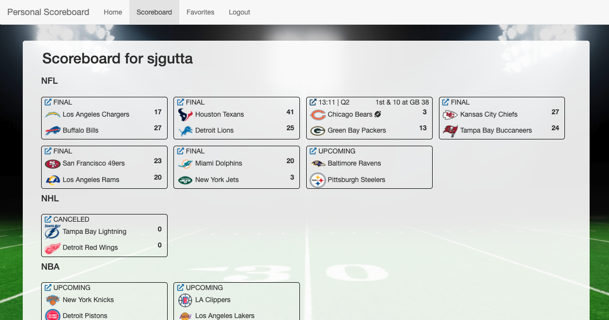

# Personal Scoreboard
This repository contains an application that serves as a personal scoreboard for sports fans. Users can create an account, add their favorite teams and have all of their scores in a single view. This is currently being implemented as a web application but will eventually be turned into a browser extension and/or application that can be accessed from the Linux toolbar.

# Installation and Usage Instructions
THESE ARE COMING SOON.

# Features
* Users can create an account with their email in order to log in and log out of the application.
* Users can select their favorite sports teams in each of the 4 major US professional sports leagues (more sports coming soon). The application provides an intuitive interface for doing this.
* Users have a personalized scoreboard view with the current or most recent scores for each of their favorited teams.
* Each score provided on the scoreboard provides a link to the ESPN event for that game.
* The homepage of the application features a list of features and useful links for sports fans (e.g. espn.com).
* Feel free to raise issues on this repository or to contact me if you have specific features that you would enjoy if implemented. This tool is designed to benefit all sports fans!

# Views
## Homepage
The homepage provides a list of features in the application. It also features tiles with useful links for sports fans. See images of this below.

## Favorites Page
The favorites page is where users can select their favorites teams to appear in the scoreboard. It provides drag and drop lists to easily select and deselect favorite teams. The view has a toggle for determining what sport's teams to show in the list of unfavorited teams. An article about how this was implemented is coming soon on my Medium page.

## Scoreboard
The scoreboard organizes team scores by the sports league they are in. It features the most recent game score for each of the user's favorited teams. The scoreboard constantly updates in the background without the user having to refresh the page.

# Implementation
* The backend was built using Python Flask.
* The database is in MySQL with the Peewee ORM for working with database models in code.
* The frontend is a mix of HTML, CSS, and JavaScript.
* Currently, an internal API and JavaScript are being used to allow the scoreboard to update without refreshing. An ultimate goal is to switch over to using React in order to use a framework designed for handling asynchronous data fetching.